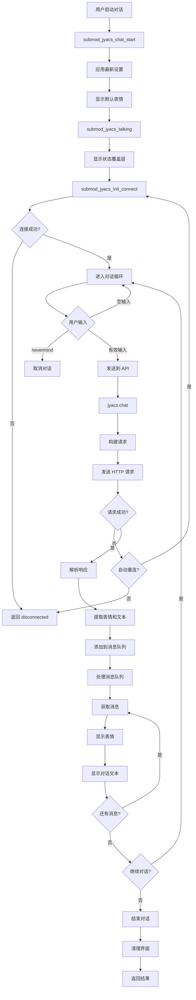

# JYACS 对话系统设计分析文档

## 概述

JYACS (JustYuri AI Chat Submod) 是一个为 DDLC 的 JustYuri mod 设计的 AI 对话系统。它通过 HTTP API 调用大语言模型，实现与角色 Yuri 的自然对话交互。系统采用模块化设计，包含 API 集成、表情系统、文本处理、配置管理等核心组件。

## 系统架构

### 核心模块

```
JYACS 系统架构
├── 初始化层 (jyacs_init.rpy)
│   ├── Python 路径配置
│   ├── 持久化数据初始化
│   └── 晚期初始化钩子
│
├── 框架层 (jyacs_framework.rpy)
│   ├── SubmodUtils - 子模组工具
│   ├── ConsoleSystem - 控制台系统
│   └── UISystem - UI 系统
│
├── API 核心层 (jyacs_api.rpy)
│   ├── JyacsAi - AI 聊天核心类
│   ├── 配置加载与管理
│   ├── API 连接与请求
│   └── 消息队列管理
│
├── 表情系统层 (jyacs_expressions.rpy + jyacs_emotion.py)
│   ├── yuri_display - 表情显示系统
│   ├── JyacsEmoSelector - 情绪选择器
│   ├── JyacsEmotionAnalyzer - 情绪分析器
│   └── JUSTYURI 表情编码解析
│
├── 文本处理层 (jyacs_interface.py)
│   ├── JyacsTalkSplitV2 - 文本分句器
│   ├── JyacsTextProcessor - 文本处理器
│   └── 文本格式化工具
│
├── 工具层 (jyacs_utils.py)
│   ├── JyacsLogger - 日志记录器
│   ├── JyacsConfig - 配置管理器
│   ├── JyacsFileUtils - 文件工具
│   ├── JyacsTimeUtils - 时间工具
│   └── JyacsTextUtils - 文本工具
│
├── 主逻辑层 (jyacs_main.rpy)
│   ├── 聊天界面标签
│   ├── 对话循环逻辑
│   ├── 消息处理流程
│   └── 特殊功能 (MSpire, MPostal)
│
└── 设置层 (jyacs_settings.rpy)
    ├── 设置界面
    ├── 高级设置界面
    └── 输入界面
```

### 初始化优先级

系统使用 Ren'Py 的 `init` 优先级机制确保正确的初始化顺序：

1. **init -1700**: Python 路径设置
2. **init -1650**: 持久化数据初始化
3. **init -1600**: 兼容性函数定义
4. **init -1500**: 框架基础类定义
5. **init -1400**: 全局实例创建
6. **init -1200**: 表情系统初始化
7. **init -890**: 变量和函数初始化
8. **init -750**: API 核心实例创建
9. **init 5**: 聊天界面函数
10. **init 10**: 样式定义
11. **init 15**: 界面屏幕定义

## 对话流程详解

### 完整对话流程



### 关键步骤详解

#### 1. 初始化连接 (submod_jyacs_init_connect)

```python
# 流程：
1. 检查是否已连接
2. 如果未连接，应用最新设置
3. 调用 jyacs.init_connect()
4. 发送测试请求验证连接
5. 根据结果返回状态
```

#### 2. 消息发送 (jyacs.chat)

```python
# 流程：
1. 验证 API 地址有效性
2. 检查连接状态
3. 设置响应状态标志
4. 构建消息数组：
   - 添加系统提示 (system_prompt)
   - 添加用户消息 (使用模板格式化)
5. 构建完整请求数据：
   - model: 模型名称
   - messages: 消息数组
   - temperature: 温度参数
   - top_p: Top-P 参数
   - max_tokens: 最大令牌数
6. 发送 HTTP POST 请求
7. 解析响应并提取回复文本
8. 分析表情并添加到消息队列
9. 更新统计信息
10. 重置响应状态标志
```

#### 3. 消息处理循环

```python
# 在 submod_jyacs_talking 中：
while True:
    # 1. 检查消息队列
    if jyacs.len_message_queue() > 0:
        # 获取消息
        message = jyacs.get_message()
        expression_code, text = message
        
        # 显示表情
        show_chr(expression_code)
        
        # 显示对话
        y(text)
        
        # 检查是否还有更多消息
        if not jyacs.is_responding and jyacs.len_message_queue() == 0:
            break
    else:
        # 等待消息
        if jyacs.is_responding:
            y(".{w=0.3}.{w=0.3}.{w=0.3}{nw}")
        renpy.pause(0.5, hard=True)
        
        # 确保正确退出
        if not jyacs.is_responding and jyacs.len_message_queue() == 0:
            break
```

## API 集成设计

### 配置结构

```json
{
    "version": "1.0.0",
    "prompts": {
        "system_prompt": "角色设定和行为规则...",
        "user_prompt_template": "[player]说：{message}\n\n请以优里的身份回应..."
    },
    "api_config": {
        "temperature": 0.7,
        "top_p": 0.9,
        "max_tokens": 2048,
        "presence_penalty": 0.0,
        "frequency_penalty": 0.0
    }
}
```

### 系统提示词设计

系统提示词采用结构化设计，包含以下部分：

1. **角色定义 (Role)**: 定义 Yuri 的身份和基本特征
2. **技能 (Skills)**: 列出 Yuri 的对话能力和模板句
3. **背景 (Background)**: Yuri 对其他角色和世界的看法
4. **目标 (Goals)**: 对话生成的目标和要求
5. **输出格式 (OutputFormat)**: 输出的格式要求
6. **规则 (Rules)**: 必须遵守的对话规则
7. **工作流程 (Workflows)**: 处理用户输入的步骤

### API 请求构建

```python
# 请求结构：
{
    "model": "模型名称",
    "messages": [
        {
            "role": "system",
            "content": "系统提示词（完整的角色设定）"
        },
        {
            "role": "user",
            "content": "格式化后的用户消息"
        }
    ],
    "temperature": 0.7,
    "top_p": 0.9,
    "max_tokens": 2048
}
```

### 错误处理机制

```python
# 错误类型和处理：
1. 连接错误 (URLError):
   - 记录错误日志
   - 设置 is_failed = True
   - 显示错误通知
   - 如果启用自动重连，尝试重新连接

2. API 错误 (HTTP 状态码 != 200):
   - 记录错误信息
   - 设置 is_failed = True
   - 返回错误状态

3. 解析错误 (JSON 解析失败):
   - 记录详细错误
   - 使用默认配置
   - 继续运行

4. 配置错误 (无效的 API 地址):
   - 验证 URL 格式
   - 拒绝无效地址
   - 显示错误提示
```

## 表情系统设计

### JUSTYURI 表情编码格式

表情编码格式：`X-YYYYY-ZZZZ`

```
X: 头部位置
   - A: 正面 (front)
   - B: 侧面 (side)

YYYYY: 面部特征
   - Y[0]: 眼睛索引 (Base64 字符，0-63)
   - Y[1]: 嘴巴类型 (a-z)
   - Y[2]: 眉毛类型 (a-z)
   - Y[3]: 脸红效果 (A=无, B=有)
   - Y[4]: 哭泣效果 (A=无, B=有)

ZZZZ: 手臂位置
   - 如果 ZZ[0:2] == "ZZ": 双臂模式
     - ZZ[2]: 双臂索引
   - 否则: 单臂模式
     - Z[1]: 左臂索引
     - Z[3]: 右臂索引
```

### 情绪分析流程

```python
# JyacsEmoSelector.analyze() 流程：
1. 接收文本输入
2. 遍历所有情绪模式：
   - happy: 开心、高兴、快乐...
   - love: 爱、喜欢...
   - sad: 难过、伤心...
   - angry: 生气、愤怒...
   - worried: 担心、忧虑...
   - thinking: 思考、想...
   等等
3. 对每个情绪：
   - 使用正则表达式匹配关键词
   - 累加匹配次数
   - 应用情绪权重
4. 选择得分最高的情绪
5. 从该情绪的表情列表中随机选择一个
6. 更新 current_emotion
7. 返回处理后的文本
```

### 表情到情绪的映射

```python
# 关键词 -> 表情编码映射示例：
{
    '开心': "A-CFGAA-AIAI",      # 开心表情
    '思考': "A-BFAAA-AAAC",      # 思考表情
    '难过': "A-DGFAA-ABAB",      # 悲伤表情
    '生气': "A-HCBBA-ABAB",      # 生气表情
    '惊讶': "A-ICAAA-ALAL",      # 惊讶表情
    '平静': "A-ACAAA-AAAA",      # 默认中性表情
}
```

## 配置管理设计

### 配置层次

```
配置层次结构：
1. 默认配置 (代码中硬编码)
   - DEFAULT_SYSTEM_PROMPT
   - DEFAULT_USER_PROMPT_TEMPLATE
   - 默认 API 参数

2. 配置文件 (jyacs_config.json)
   - 系统提示词
   - 用户提示模板
   - API 配置参数
   - 日志配置

3. 持久化设置 (persistent.jyacs_setting_dict)
   - API 密钥
   - API 地址
   - 模型名称
   - 用户偏好设置

4. 高级设置 (persistent.jyacs_advanced_setting)
   - Temperature
   - Top P
   - Max Tokens
   - Frequency Penalty
   - Presence Penalty
```

### 配置加载流程

```python
# JyacsAi.__init__() 中的配置加载：
1. 初始化默认值
2. 调用 _load_config():
   a. 确定配置文件路径
   b. 尝试多个可能的路径
   c. 读取并解析 JSON
   d. 验证配置结构
   e. 加载系统提示和模板
   f. 加载 API 参数
3. 如果加载失败，使用默认配置
4. 设置 _config_loaded 标志
5. 记录配置状态日志
```

### 配置应用机制

```python
# jyacs_apply_setting() 流程：
1. 从 persistent.jyacs_setting_dict 读取用户设置
2. 调用 jyacs.set_api():
   - 设置 API 密钥
   - 验证并设置 API 地址
   - 设置模型名称
3. 可选：强制重新加载配置文件
4. 显示应用成功通知
5. 返回应用结果
```

## 文本处理设计

### 文本分句器 (JyacsTalkSplitV2)

```python
# 工作原理：
1. 维护内部缓冲区
2. 使用正则表达式识别句末标点：
   - 中文：。！？
   - 英文：.!?
   - 换行符：\n
3. split_present_sentence():
   - 查找第一个句末标点
   - 提取完整句子
   - 从缓冲区移除已提取部分
   - 返回句子
4. announce_stop():
   - 返回缓冲区中所有剩余文本
   - 清空缓冲区
```

### 文本格式化

```python
# add_pauses() 函数：
1. 在主要断句符号后添加长暂停 {p}：
   - 。！？.!?
2. 在次要断句符号后添加短暂停 {w}：
   - ，、,;；
3. 在换行符后添加暂停 {p}
4. 返回格式化后的文本

# 用途：
- 控制对话显示速度
- 提供自然的阅读节奏
- 增强对话的表现力
```

### 关键词替换

```python
# key_replace() 函数：
1. 接收文本和替换字典
2. 遍历字典中的每个键值对
3. 将文本中的键替换为值
4. 返回替换后的文本

# 应用场景：
- 替换占位符 ([player], [persistent.yuri_nickname])
- 本地化文本
- 自定义对话内容
```

## 状态管理设计

### 连接状态

```python
# 状态枚举：
- "disconnected": 未连接
- "connecting": 连接中
- "connected": 已连接
- "failed": 连接失败

# 状态标志：
- is_connecting: 正在连接
- is_connected: 已连接
- is_failed: 连接失败

# 状态转换：
disconnected -> connecting -> connected
                           -> failed -> disconnected (重连)
```

### 对话状态

```python
# 状态标志：
- is_chatting: 正在发送消息
- is_responding: 正在等待响应
- is_ready_to_input: 准备接收输入

# 状态转换：
ready_to_input -> chatting -> responding -> ready_to_input
                                         -> failed
```

### 消息队列

```python
# 队列结构：
message_queue = [
    (expression_code, text),
    (expression_code, text),
    ...
]

# 操作：
- 添加消息：message_queue.append((emote, text))
- 获取消息：message_queue.pop(0)
- 队列长度：len(message_queue)
- 清空队列：message_queue.clear()
```

### 统计数据

```python
# stat 字典：
{
    "total_chat": 0,              # 总对话次数
    "total_received_token": 0,    # 总接收令牌数
    "received_token": 0,          # 当前接收令牌数
    "total_time": 0,              # 总时间
    "total_cost": 0,              # 总成本
    "session_id": 0               # 会话 ID
}

# 更新时机：
- 发送消息时：total_chat += 1
- 接收响应时：received_token = len(reply)
                total_received_token += len(reply)
```

## 用户界面设计

### 设置界面结构

```
jyacs_settings 屏幕
├── 标题
├── API 配置区域
│   ├── API 密钥输入
│   ├── API 地址输入
│   └── 模型名称输入
├── 连接状态区域
│   ├── 状态显示
│   ├── 消息队列显示
│   └── 操作按钮（连接/断开/验证）
└── 底部按钮
    ├── 保存设置
    ├── 高级设置
    └── 关闭
```

### 高级设置界面

```
jyacs_advanced_settings 屏幕
├── 标题
├── 超参数设置区域
│   ├── Temperature 滑块
│   ├── Top P 滑块
│   ├── Max Tokens 滑块
│   ├── Frequency Penalty 滑块
│   └── Presence Penalty 滑块
└── 底部按钮
    ├── 保存设置
    └── 返回
```

### 状态覆盖层

```python
# jyacs_status_overlay 屏幕：
- 显示在屏幕右上角
- 当 is_responding = True 时显示
- 内容："思考中..."
- 背景：半透明黑色
- 用途：提示用户 AI 正在生成响应
```

## 兼容性设计

### Python 2/3 兼容性

```python
# 导入兼容性处理：
try:
    # Python 3
    from urllib.request import urlopen, Request
    from urllib.error import URLError
except ImportError:
    # Python 2
    from urllib2 import urlopen, Request, URLError

# 字符串类型兼容：
- Python 2: str, unicode
- Python 3: str
- 检查：isinstance(text, (str, unicode))

# JSON 错误处理：
- Python 2: ValueError
- Python 3: json.JSONDecodeError
- 统一捕获 ValueError
```

### Ren'Py 集成

```python
# 初始化优先级：
- 使用 init 语句控制加载顺序
- 负数优先级：越小越早加载
- 正数优先级：越大越晚加载

# 标签命名：
- 使用 submod_ 前缀避免冲突
- 示例：submod_jyacs_chat_start

# 持久化数据：
- 使用 persistent 对象存储用户数据
- 自动保存和加载
```

### JUSTYURI 兼容性

```python
# 表情系统集成：
- 使用 JUSTYURI 的表情编码格式
- 调用 show_chr() 显示表情
- 兼容 JUSTYURI 的表情图像系统

# 避免冲突：
- 检查已有定义：hasattr(store, 'name')
- 使用独立的命名空间
- 不覆盖原有功能
```

## 扩展性设计

### 触发器系统

```python
# MTriggerManager 类：
- add_trigger(id, pattern, response): 添加触发器
- remove_trigger(id): 移除触发器
- check_trigger(text): 检查文本是否触发
- import_settings(settings): 导入设置

# 触发器结构：
{
    "trigger_id": {
        "pattern": "关键词或正则",
        "response": "触发后的响应",
        "enabled": True
    }
}
```

### 钩子系统

```python
# after_load 钩子：
- 游戏加载后执行
- 用于晚期初始化
- 示例：jyacs_late_init()

# content_func 钩子：
- 自定义日志处理
- 示例：jyacs.content_func = custom_log_func
```

### 插件机制

```python
# SubmodUtils.functionplugin 装饰器：
- 注册插件函数
- 自动发现和调用
- 扩展系统功能

# 使用示例：
@store.jyacs_submod_utils.functionplugin("category")
def my_plugin_function():
    # 插件逻辑
    pass
```

### 配置扩展

```python
# 添加新配置项：
1. 在 jyacs_config.json 中添加配置
2. 在 persistent.jyacs_setting_dict 中添加默认值
3. 在设置界面中添加输入控件
4. 在 jyacs_apply_setting() 中应用配置
5. 在相关模块中使用配置
```

## 性能优化建议

### 1. 消息队列优化

- 使用 collections.deque 替代 list
- 提高 pop(0) 操作的性能

### 2. 正则表达式优化

- 预编译常用正则表达式
- 避免重复编译

### 3. 日志优化

- 使用日志级别过滤
- 避免频繁的文件 I/O
- 考虑使用缓冲

### 4. API 请求优化

- 实现请求缓存
- 支持流式响应
- 添加请求超时控制

### 5. 表情系统优化

- 缓存表情分析结果
- 减少重复的表情解析

## 安全性考虑

### 1. API 密钥保护

- 不在日志中记录完整密钥
- 使用加密存储（可选）
- 提供密钥验证机制

### 2. 输入验证

- 验证 API 地址格式
- 限制输入长度
- 过滤特殊字符

### 3. 错误处理

- 捕获所有异常
- 提供友好的错误提示
- 记录详细的错误日志

### 4. 配置验证

- 验证配置文件格式
- 检查必需字段
- 使用默认值作为后备

## 测试策略

### 1. 单元测试

- 测试文本处理函数
- 测试情绪分析逻辑
- 测试配置加载

### 2. 集成测试

- 测试 API 连接
- 测试完整对话流程
- 测试错误恢复

### 3. 用户测试

- 测试界面交互
- 测试对话质量
- 测试性能表现

## 未来改进方向

### 1. 功能增强

- 支持多轮对话历史
- 添加对话记忆功能
- 支持更多 AI 模型
- 添加语音合成

### 2. 性能优化

- 实现异步 API 调用
- 添加响应缓存
- 优化表情加载

### 3. 用户体验

- 改进设置界面
- 添加对话导出功能
- 提供更多自定义选项

### 4. 开发者体验

- ��供详细的 API 文档
- 添加调试工具
- 改进错误提示
